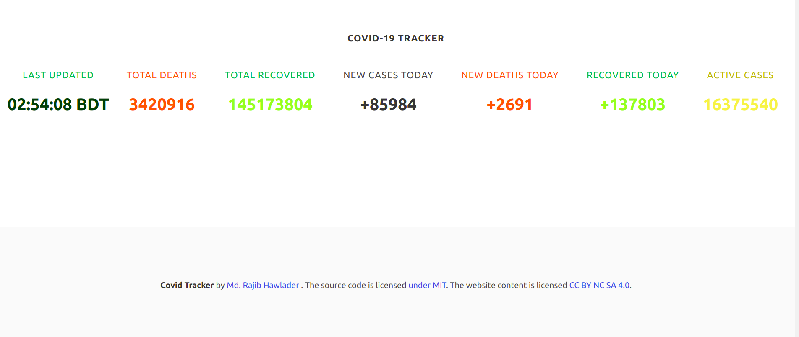

# CovidTrackerApp
This is API based Covid cases tracker App built using Flask framework of Python. This App is live here: <a href="https://covid19trackerbyrajib.herokuapp.com/"> Covid Tracker </a> 
<strong>[N.B]  This app is not mobile Responsive </strong>  
 
